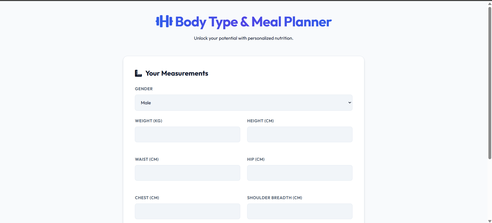
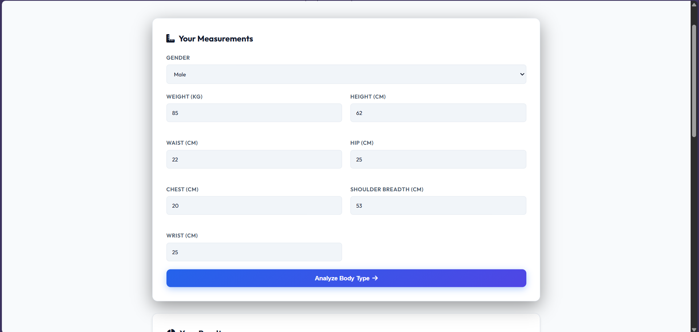
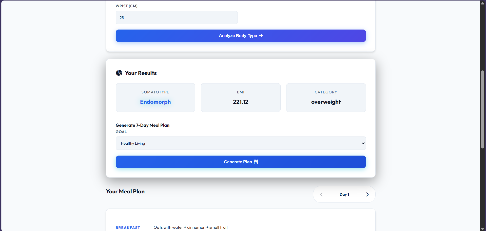
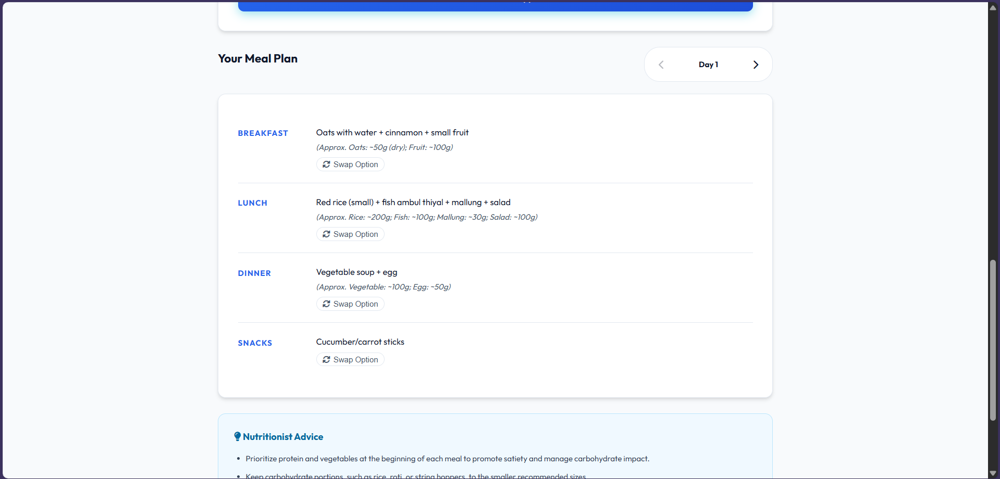
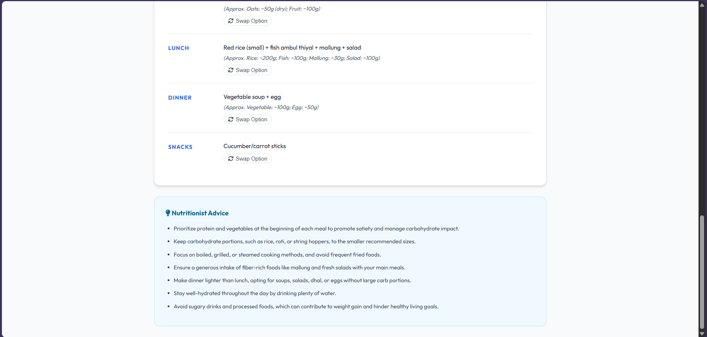

# Body Type & Meal Planner

A full-stack application that predicts your body somatotype (Ectomorph, Mesomorph, Endomorph) based on body measurements and generates a personalized 7-day meal plan to help you achieve your fitness goals.



## Features

- **Body Type Prediction**: Uses a Machine Learning model (Logistic Regression) to classify body types based on gender and anthropometric measurements.
- **Personalized Meal Plans**: Generates 7-day meal plans tailored to your body type and fitness goal (Muscle Gain, Weight Loss, Maintenance) using RAG (Retrieval-Augmented Generation).
- **Interactive UI**: Clean and responsive frontend to input data and view results.
- **Meal Swapping**: Option to swap meal choices between main and alternative options.

## Tech Stack

- **Backend**: FastAPI (Python)
- **Frontend**: HTML, CSS, JavaScript (Vanilla)
- **ML Model**: Scikit-learn (Logistic Regression)
- **Data Processing**: Pandas, NumPy

## Prerequisites

- Python 3.8+
- `pip` (Python package manager)

## Installation

1.  **Clone the repository:**

    ```bash
    git clone <repository-url>
    cd Body-Type
    ```

2.  **Create a virtual environment (optional but recommended):**

    ```bash
    python -m venv venv
    # Windows
    venv\Scripts\activate
    # macOS/Linux
    source venv/bin/activate
    ```

3.  **Install backend dependencies:**
    ```bash
    pip install -r requirements.txt
    ```

## Running the Application

### 1. Start the Backend Server

The backend runs on `http://localhost:8000`.

```bash
uvicorn app.main:app --reload
```

### 2. Start the Frontend

Open a new terminal, navigate to the `frontend` directory, and start a simple HTTP server.

```bash
cd frontend
python -m http.server 8080
```

Access the application at **[http://localhost:8080](http://localhost:8080)**.

## Usage

1.  **Enter Measurements**: Fill in your gender, weight, height, and body circumference measurements.

    

2.  **Analyze**: Click "Analyze Body Type" to see your Somatotype, BMI, and Category.

    

3.  **Generate Plan**: Select your fitness goal and generate a 7-day meal plan.

    

    The plan includes a "Nutritionist Advice" section with helpful tips:

    

## API Endpoints

- `POST /body-type/predict`: Predicts somatotype based on measurements.
- `POST /meal-plan/generate`: Generates a meal plan based on profile and goal.

## Project Structure

```
Body-Type/
├── app/
│   ├── main.py            # FastAPI entry point
│   ├── services/          # Business logic (model, RAG)
│   └── ...
├── frontend/
│   ├── index.html         # Main UI
│   ├── style.css          # Styles
│   └── app.js             # Frontend logic
├── scripts/               # Utility scripts (training, verification)
├── requirements.txt       # Python dependencies
└── README.md              # Project documentation
```

## License

[MIT](LICENSE)
